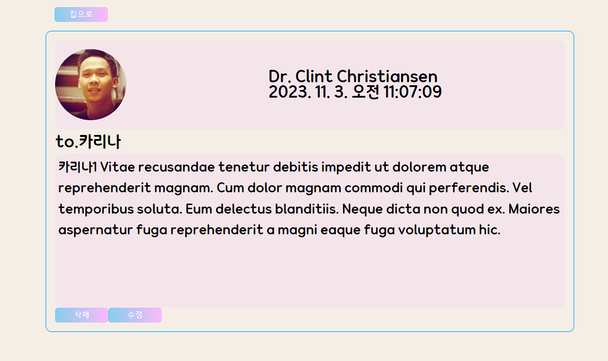

# ✉️FanLetter 프로젝트✉️

 🎞️미리보기🎞️

### 메인페이지

> </img>
>
> ### 세부 페이지
>
> </img>

---

### 🔨prop-drilling, Context API, Redux를 사용한 각각의 브랜치를 제작했습니다.

- 생성, 수정, 삭제 기능을 지원하고 있습니다.

  - AddComment에서는 생성을, RenderComment에서는 제작을 담당합니다.

- 모달창 구현을 시도해보았습니다.

  - 모달창에서 수정기능을 지원하고 있습니다.
  - DetailComment 에서 역할을 담당하고 있습니다.

- 공용 버튼을 사용하고 있습니다.

  - Button 컴포넌트가 공용컴포넌트로 사용중이며 조건부 스타일링을 적용했습니다.

- Styled-component 를 사용하여 디자인하였습니다.
  - 조건부 스타일링을 통한 모달창 구현과 버튼의 색상변경을 도입했습니다.
  - 폰트는 **눈누**(https://noonnu.cc/) 에서 **무료 웹폰트**를 적용했습니다.
    - **국민연금체**를 사용했습니다.(https://noonnu.cc/font_page/1239)

---

### 🛠️마주한 문제와 해결과정🛠️

- [x] prop으로 주고 받는 정보의 이름을 혼동하는 경우가 많았습니다.

  - 함수 이름과 대중적인 표현을 사용하여 수정을 거쳤습니다.

- [x] 자녀 컴포넌트에서 정보를 주고 받았기 때문에 Home.jsx와 Detail.jsx간의 정보 전달이 불가능했습니다.

  - 상위 컴포넌트인 Router에서 생성, 수정, 삭제를 진행하고 prop으로 전달하는 방식으로 전환했습니다.

- [ ]모달창을 외부에서 호출하는 방식으로 변경하고 해당 코드 부분을 리팩토링 하고자했습니다.

  - 해당부분의 작업시간이 모자라 진행하지 못했습니다.
